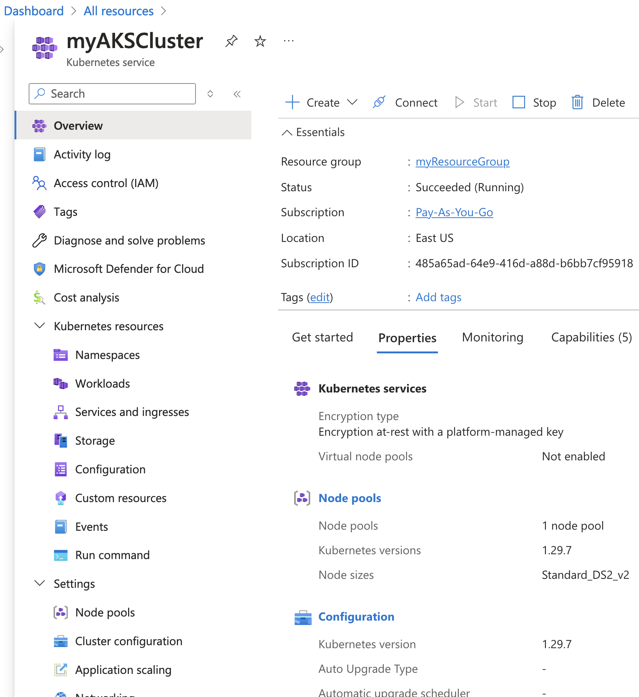

### Part 1: Introduction and Setup for Azure Kubernetes Service (AKS)

#### Introduction

##### **Overview of the Lab Objectives**
- Set up an Azure Kubernetes Service (AKS) cluster using Azure CLI.

##### **Brief on the AKS Architecture**
- **Azure Kubernetes Service (AKS)**: Managed Kubernetes service for deploying, managing, and scaling containerized applications.
- **Azure CLI**: Command-line tool for managing Azure resources.

##### **Tools and Technologies Required**
- **Azure CLI**: Command-line tool for managing Azure resources.
- **Azure Subscription**: Required to create and manage Azure resources.
- **AKS**: Azure service for managing Kubernetes clusters.

#### Environment Setup

##### **Install Azure CLI**
**Azure CLI Installation**
   - If you completed the Key Vault lab, Azure CLI (`az`) should already be installed on your system.
   - If not, follow the instructions from Part 1 of the Key Vault lab to install Azure CLI on your system

##### **Verify Installation**
- Open a terminal or command prompt and run:
  ```bash
  az --version
  ```

- You should see output indicating the installed version of Azure CLI.

##### **Login to Azure and Select Subscription**

```bash
az login
```

- Use the Azure CLI to log in to your Azure account. After logging in, you will see a list of available subscriptions and a prompt to select a subscription. Select the one specified by your instructor.

##### **Verify Current Tenant and Subscription**

```bash
az account show
```

- This command displays the details of the currently selected subscription and tenant. Verify that the correct subscription and tenant are selected.

##### **Install kubectl**
**kubectl Installation**
   - Follow the instructions from the official Kubernetes website to install `kubectl` on your system:
     - [kubectl for Windows](https://kubernetes.io/docs/tasks/tools/install-kubectl-windows/)
     - [kubectl for Mac](https://kubernetes.io/docs/tasks/tools/install-kubectl-macos/)
     - [kubectl for Linux](https://kubernetes.io/docs/tasks/tools/install-kubectl-linux/)

- Verify `kubectl` installation by running:
  ```bash
  kubectl version --client
  ```

- You should see output indicating the installed version of `kubectl`.

##### **Create a Resource Group**  
   - If you completed the Key Vault lab, a resource group (`myResourceGroup`) should already exist.
   - If not, follow the instructions from Part 1 of the Key Vault lab to create a resource group.

#### Create an AKS Cluster

##### **Create an AKS Cluster**
Create an AKS cluster in the resource group. Note: Cluster names must be unique within the resource group. To ensure this, append your initials and a unique number to the cluster name. For example:

```bash
az aks create --resource-group myResourceGroup --name myAKSCluster --node-count 2 --enable-addons monitoring --generate-ssh-keys
```
- **Note:** This command can take up to 10 minutes to complete.

##### **Authenticate to the AKS Cluster**

```bash
az aks get-credentials --resource-group myResourceGroup --name myAKSCluster
```

- This command configures `kubectl` to use your credentials for the AKS cluster.

##### **List System Pods in the AKS Cluster**

```bash
kubectl get pods --namespace kube-system
```

- This command lists the system pods running in the `kube-system` namespace of the AKS cluster.
- The kube-system namespace is used by Kubernetes to manage system-level components, such as networking and cluster services, including the core DNS, the Kubernetes dashboard, and the API server.

##### **View the AKS Cluster in the Azure Portal**
- Open the [Azure Portal](https://portal.azure.com/).
- Navigate to "Resource groups" in the left-hand menu.
- Select the resource group [`myResourceGroup`].
- Click on the AKS cluster [`myAksCluster`] to view its details.



##### **Familiarize Yourself with the AKS Cluster**
- Take some time to explore the different resources and settings within the AKS cluster. For instance:
  - **Node Pools**: View the nodes that make up the AKS cluster.
  - **Workloads**: Check the deployed workloads, including deployments, pods, and replica sets.
  - **Services and Ingress**: Review the services and ingress controllers that manage network traffic.
  - **Storage**: Examine the storage options, including persistent volume claims and storage classes.
  - **Monitoring**: Explore the monitoring tools and metrics available for the cluster.
  - **Access Control (IAM)**: Review the role-based access control (RBAC) settings and permissions.

### Next Steps
Proceed to Part 2 where you will deploy and manage containerized applications in AKS.