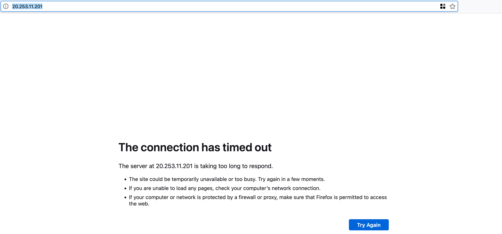
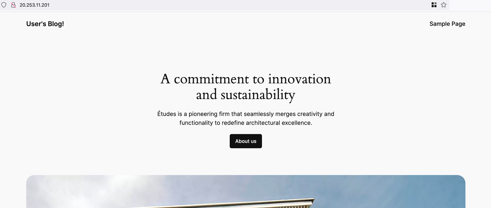

### Part 4: Debugging the WordPress Application

#### Introduction

##### **Overview of the Lab Objectives**
- Simulate a failure in the WordPress deployment.
- Use debugging tools and techniques to identify and diagnose the issue.
- Fix the problem and verify the solution.

#### Environment Setup

##### **Prerequisites**
- Ensure you have completed Part 1, Part 2, and Part 3 of the lab.
- Ensure `kubectl` and `helm` CLI tools are installed and configured.

#### Simulate a Failure

##### **Break the WordPress Deployment**

**Scale the Deployment to 0 Replicas**

```bash
kubectl scale deployment my-wordpress --replicas=0
```

- This command scales the WordPress deployment to 0 replicas, effectively stopping all running pods.

**Edit the WordPress Deployment to Introduce an Error**

```bash
kubectl edit deployment my-wordpress
```

**Modify the Image Name to an Invalid Value**

- Change the image name under `spec.template.spec.containers` to an invalid value.
- If you're struggling to find the correct line, do a search for 'wordpress:'. It should be the first result.

```yaml
image: bitnami/wordpress:invalid-tag
```

- Save and exit the editor.

**Scale the Deployment to 1 Replica**

```bash
kubectl scale deployment my-wordpress --replicas=1
```

- This command scales the WordPress deployment to 1 replica, starting a new pod with the invalid image.

#### Debug the Application

##### **Check the Status of the Pods**

```bash
kubectl get pods
```

- This command lists the pods in the default namespace, showing the status of the WordPress pods. After a couple of minutes, you should see that the pods are in a `CrashLoopBackOff` or `ImagePullBackOff` state.

##### **Describe the Failing Pod**

```bash
kubectl describe pod <pod-name>
```

- Replace `<pod-name>` with the name of one of the failing pods. This command provides detailed information about the pod, including events and error messages.
- You should see something similar to this:
  ```
  Normal   Pulling                 70s (x4 over 2m33s)  kubelet                  Pulling image "docker.io/bitnami/wordpress:invalid-tag"
  Warning  Failed                  70s (x4 over 2m33s)  kubelet                  Failed to pull image "docker.io/bitnami/wordpress:invalid-tag": rpc error: code = NotFound desc = failed to pull and unpack image "docker.io/bitnami/wordpress:invalid-tag": failed to resolve reference "docker.io/bitnami/wordpress:invalid-tag": docker.io/bitnami/wordpress:invalid-tag: not found
  ```

##### **Check the Logs of the Failing Pod**

```bash
kubectl logs <pod-name>
```

- Replace `<pod-name>` with the name of one of the failing pods. This command retrieves the logs from the pod, which can help identify the cause of the failure.
- You should see something similar to this:
  ```
  Defaulted container "wordpress" out of: wordpress, prepare-base-dir (init)
  Error from server (BadRequest): container "wordpress" in pod "my-wordpress-54c6f47595-b5pd9" is waiting to start: trying and failing to pull image
  ```
- As you can see, it is failing to pull an image with a non-existent tag.

##### **Browse to the Application**

```bash
kubectl get svc --namespace default my-wordpress
```

- This command retrieves the external IP address of the WordPress service. Open a web browser and navigate to the external IP address. This request should eventually time out.



#### Fix the Problem

**Scale the Deployment to 0 Replicas**

```bash
kubectl scale deployment my-wordpress --replicas=0
```

##### **Edit the WordPress Deployment to Correct the Error**

```bash
kubectl edit deployment my-wordpress
```

- Change the image name back to the correct value, for example:

```yaml
image: bitnami/wordpress:latest
```

- Save and exit the editor.

**Scale the Deployment to 1 Replica**

```bash
kubectl scale deployment my-wordpress --replicas=1
```

- This command scales the WordPress deployment to 1 replica, starting a new pod with the `latest` image.

##### **Verify the Fix**

```bash
kubectl get pods
```

- This command lists the pods in the default namespace, showing the status of the WordPress pods. The pods should eventually reach a `Running` state.

##### **Describe the Failing Pod**

```bash
kubectl describe pod <pod-name>
```

- Replace `<pod-name>` with the name of one of the failing pods. This command provides detailed information about the pod, including events and error messages.

##### **Check the Logs of the Fixed Pod**

```bash
kubectl logs <pod-name>
```

- Replace `<pod-name>` with the name of one of the running pods. This command retrieves the logs from the pod, confirming that the application is running correctly.

##### **Browse to the Application**

- Open a web browser and navigate to the external IP address to verify that the application is now running correctly.



### Next Steps
Proceed to Part 5 where you will learn how to monitor the application in Azure.
```