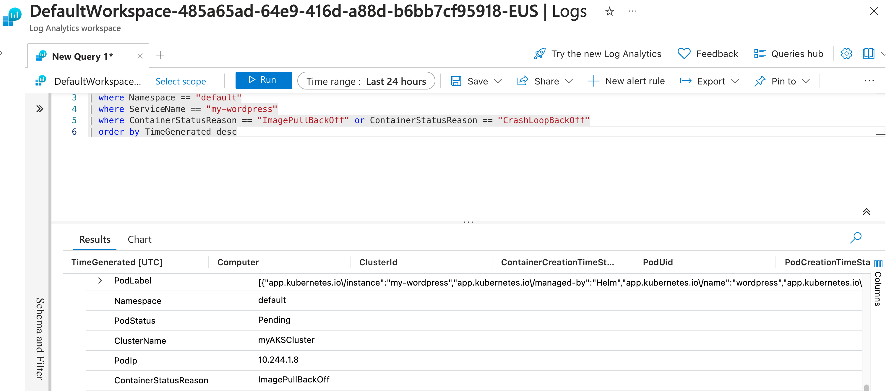

### Part 5: Monitoring the AKS Workload

#### Monitoring the Application

##### **Access the Monitoring Dashboard**

```bash
az aks show --resource-group myResourceGroup --name myAKSCluster --query addonProfiles.omsagent.config.logAnalyticsWorkspaceResourceID -o tsv
```

- This command retrieves the Log Analytics workspace resource ID.


#### View Pod Error Logs in Azure Portal

- Open the [Azure Portal](https://portal.azure.com/).
- Navigate to "Log Analytics workspaces" in the left-hand menu.
- Select the workspace exposed in the previous command.
- In the workspace, navigate to "Logs" under the "General" section.
- Use the following query to view your wordpress pod error logs:

```kusto
KubePodInventory
| where ClusterName == "myAKSCluster"
| where Namespace == "default"
| where ServiceName == "my-wordpress"
| where ContainerStatusReason == "ImagePullBackOff" or ContainerStatusReason == "CrashLoopBackOff"
| order by TimeGenerated desc
```


### Lab Completion

Congratulations! You have successfully completed the lab. You have learned how to:
- Create an AKS cluster
- Deploy an application to AKS
- Scale AKS deployments
- Simulate and debug failures in a Kubernetes deployment.
- Secure and monitor your application in AKS.
- Use Log Analytics to view and analyze pod error logs.

Feel free to explore further or proceed to additional labs to deepen your understanding of AKS and Kubernetes.