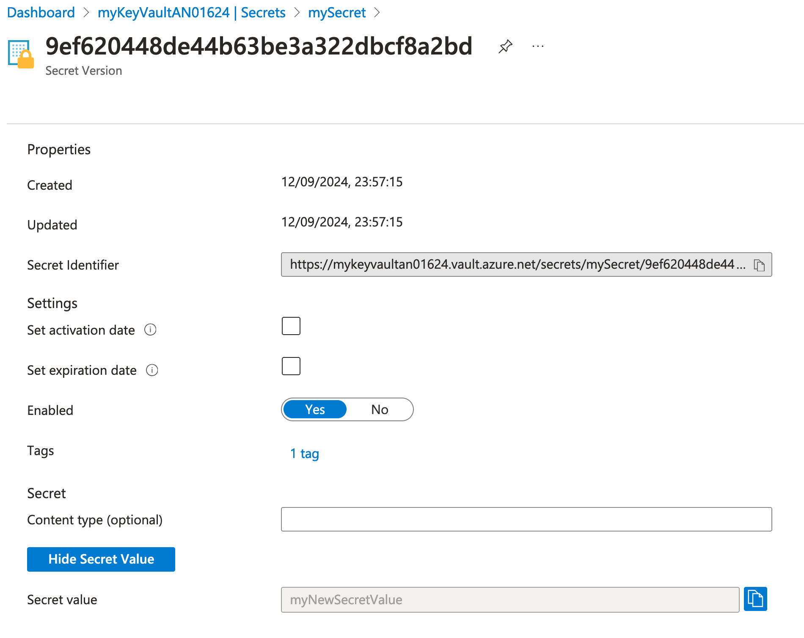

### Part 3: Creating and Retrieving Secrets

#### 1. Introduction

##### **Overview of the Lab Objectives**
- Understand the role-based access control (RBAC) requirements for managing keys.
- Assign the appropriate RBAC role to the currently logged-in user.
- Successfully create and retrieve secrets from the Key Vault.
- Create a new version of your secret.

#### 2. Assign Roles

##### Assign The Key Vault Secrets Officer Role

```bash
az role assignment create --role "Key Vault Secrets Officer" --assignee <user-object-id> --scope /subscriptions/<subscription-id>/resourceGroups/myResourceGroup/providers/Microsoft.KeyVault/vaults/<key-vault-name>
```

- This command assigns the Key Vault Secrets Officer role to the currently logged-in user for the Key Vault.

##### Verify Role Assignments

```bash
az role assignment list --assignee <user-object-id> --scope /subscriptions/<subscription-id>/resourceGroups/myResourceGroup/providers/Microsoft.KeyVault/vaults/<key-vault-name> --output table
```

- This command lists the role assignments for the specified user and scope, allowing you to verify that both the Key Vault Crypto Officer and Key Vault Secrets Officer roles have now been assigned.

#### 3. Create and Retrieve Secrets

##### Create a Secret

  ```bash
az keyvault secret set \
  --vault-name <key-vault-name> \
  --name mySecret \
  --value "mySecretValue" \
  --description "This is a test secret with additional options" \
  --tags env=test \
  --content-type "text/plain"
  ```

- This command creates a secret with the value mySecretValue, a description, tags it with env=test, and sets the content type to text/plain.

##### Retrieve the Secret

  ```bash
  az keyvault secret show --vault-name <key-vault-name> --name mySecret --query value
  ```
- Replace `<key-vault-name>` with the name of your key vault.

##### Confirm Secret Creation in the Azure Portal
- Open the [Azure Portal](https://portal.azure.com/).
- Navigate to "Resource groups" in the left-hand menu.
- Select the resource group `myResourceGroup`.
- Click on the Key Vault.
- In the Key Vault, navigate to "Secrets" under the "Settings" section.
- Confirm that the secret `mySecret` is listed.
- Click on the secret `mySecret` to view its details.
- Click on the current version.
- Click `Show Secret Value`


##### Create a New Version of the Secret

  ```bash
  az keyvault secret set --vault-name <key-vault-name> --name mySecret --value "myNewSecretValue"
  ```
- This command creates a new version of the secret mySecret with the value myNewSecretValue.

##### Confirm New Version in the Azure Portal
- Open the [Azure Portal](https://portal.azure.com/).
- Navigate to "Resource groups" in the left-hand menu.
- Select the resource group `myResourceGroup`.
- Click on the Key Vault `myKeyVault`.
- In the Key Vault, navigate to "Secrets" under the "Settings" section.
- Confirm that the secret `mySecret` is listed.
- Click on the secret `mySecret` to view its details.
- Click on the Current version
- Confirm that the new version with the value `myNewSecretValue` is listed.
- **Note:** Key vault maintains versioned secrets. Click on the older version to view the old secret value
- **Note:** Take a look at the content type and tags on both versions of the secrets.
- **Note:** The new version can take a minute or two to display in the portal. Keep refreshing the page until the new version appears.



### Next Steps  
Proceed to Part 4 where you will create and retrieve certificates.