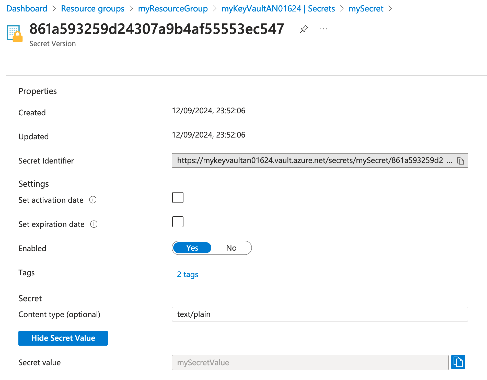

### Part 3: Creating and Retrieving Secrets

#### Introduction

##### **Overview of the Lab Objectives**
- Understand the role-based access control (RBAC) requirements for managing keys.
- Assign the appropriate RBAC role to the currently logged-in user.
- Successfully create and retrieve secrets from the Key Vault.
- Create a new version of your secret.

#### Assign Roles

##### Assign The Appropriate RBAC Role

- Use Azure documentation to find the role that allows you to create Key Vault secrets.

- Use the Azure CLI to assign the identified role to your user account. Keep the 'Prinicpal of least privilege' in mind when identifying and selecting your role.

##### Verify Role Assignments

```bash
az role assignment list --assignee <user-object-id> --scope /subscriptions/<subscription-id>/resourceGroups/myResourceGroup/providers/Microsoft.KeyVault/vaults/<key-vault-name> --output table
```

- This command lists the role assignments for the specified user and scope, allowing you to verify that both the Key Vault Crypto Officer and Key Vault Secrets Officer roles have now been assigned.

#### Create and Retrieve Secrets

- Use the Azure CLI to create a secret in your Key Vault. 

- Use the Azure CLI to output the secret from your Key Vault.

##### Confirm Secret Creation in the Azure Portal
- Open the [Azure Portal](https://portal.azure.com/).
- Navigate to "Resource groups" in the left-hand menu.
- Select the resource group `myResourceGroup`.
- Click on the Key Vault.
- In the Key Vault, navigate to "Secrets" under the "Settings" section.
- Confirm that the secret `mySecret` is listed.
- Click on the secret `mySecret` to view its details.
- Click on the current version.
- Click `Show Secret Value`



##### Create a New Version of the Secret

- Determine how to create a new version of the secret using either the Azure portal or CLI. 
- View both versions of the secret.
- Use Azure CLI to retrieve the old version of the secret.

##### Additional Secret Management tasks
- Download a backup of your secret. 
- Delete the secret in the Azure Portal
- Attempt to restore your secret. If this fails, find out why. Has the secret really been deleted?
- Restore your secret.

### Next Steps  
Proceed to Part 4 where you will create and retrieve certificates.