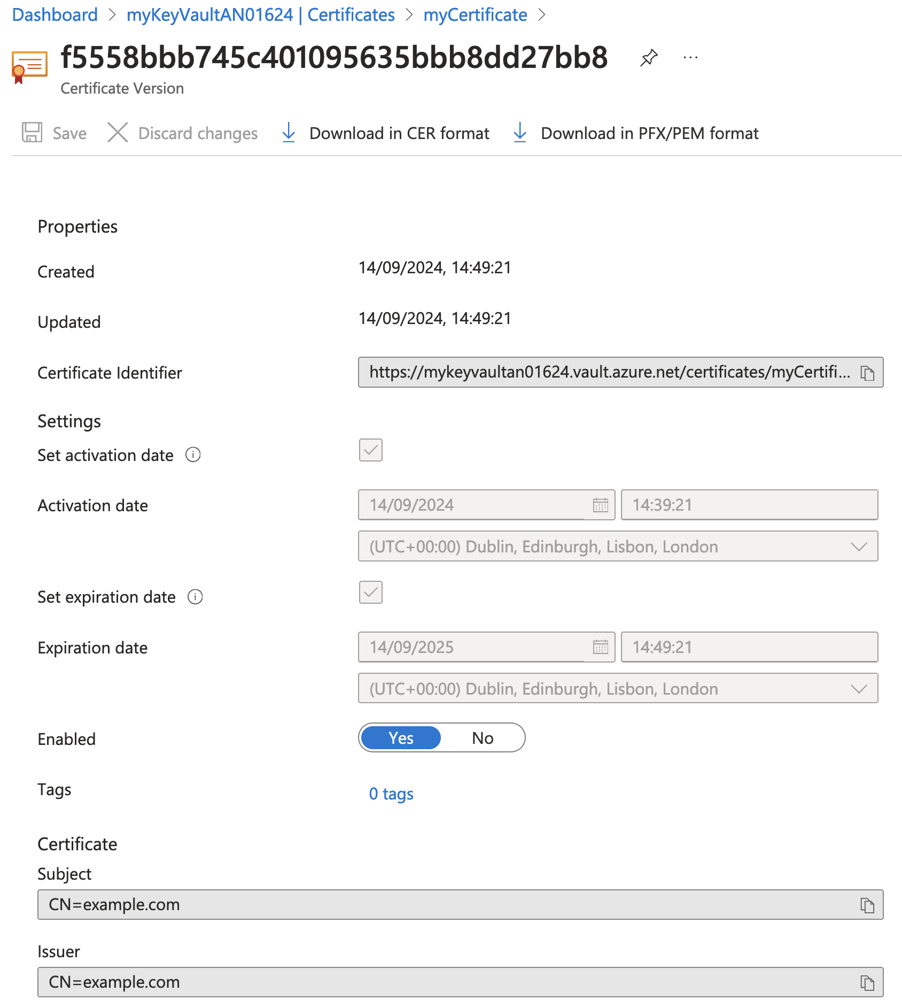

### Part 4: Creating and Retrieving Certificates

#### Introduction

##### **Overview of the Lab Objectives**
- Understand the role-based access control (RBAC) requirements for managing certificates.
- Assign the appropriate RBAC role to the currently logged-in user.
- Successfully create and retrieve certificates from the Key Vault.
- Create a new version of your certificate.

#### Assign Roles

##### Assign The Key Vault Certificates Officer Role

```bash
az role assignment create --role "Key Vault Certificates Officer" --assignee <user-object-id> --scope /subscriptions/<subscription-id>/resourceGroups/myResourceGroup/providers/Microsoft.KeyVault/vaults/<key-vault-name>
```

- This command assigns the Key Vault Secrets Officer role to the currently logged-in user for the Key Vault.

##### Verify Role Assignments

```bash
az role assignment list --assignee <user-object-id> --scope /subscriptions/<subscription-id>/resourceGroups/myResourceGroup/providers/Microsoft.KeyVault/vaults/<key-vault-name> --output table
```

- This command lists the role assignments for the specified user and scope, allowing you to verify that the Key Vault Crypto Officer, the Key Vault Secrets Officer and the Key Vault Certificates Officer roles have now been assigned.

#### Create and Retrieve Secrets

##### Create a policy.json file

```json
{
  "issuerParameters": {
    "name": "Self"
  },
  "keyProperties": {
    "exportable": true,
    "keySize": 2048,
    "keyType": "RSA",
    "reuseKey": true
  },
  "lifetimeActions": [
    {
      "action": {
        "actionType": "AutoRenew"
      },
      "trigger": {
        "daysBeforeExpiry": 30
      }
    }
  ],
  "secretProperties": {
    "contentType": "application/x-pem-file"
  },
  "x509CertificateProperties": {
    "extendedKeyUsage": ["1.3.6.1.5.5.7.3.1"],
    "keyUsage": [
      "cRLSign",
      "dataEncipherment",
      "digitalSignature",
      "keyEncipherment",
      "keyAgreement",
      "keyCertSign"
    ],
    "subject": "CN=example.com",
    "validityInMonths": 12
  }
}
```
- This policy file defines the properties of the certificate, including the key type, key size, subject, and validity period.

##### **Create a Certificate**

```bash
az keyvault certificate create --vault-name <key-vault-name> --name myCertificate --policy @policy.json
```

- This command creates a certificate named `myCertificate` in the Key Vault using the policy defined in the `policy.json` file.

##### **Retrieve the Certificate**

```bash
az keyvault certificate show --vault-name <key-vault-name> --name myCertificate
```

- This command retrieves the details of the certificate named `myCertificate` from the Key Vault `<key-vault-name>`.

#### Confirm Certificate Creation in the Azure Portal

##### **View the Certificate in the Azure Portal**
- Open the [Azure Portal](https://portal.azure.com/).
- Navigate to "Resource groups" in the left-hand menu.
- Select the resource group `myResourceGroup`.
- Click on the Key Vault.
- In the Key Vault, navigate to "Certificates" under the "Settings" section.
- Confirm that the certificate `myCertificate` is listed.
- Click on the certificate `myCertificate` to view its details.
- Click on the current version.
- Under the "Properties" section, confirm that the certificate properties are correctly set.



#### Export the Certificate

##### **Export the Certificate**

```bash
az keyvault secret download --vault-name <key-vault-name> --name myCertificate --file myCertificate.pem
```

- This command exports the certificate named `myCertificate` from the Key Vault to a file named `myCertificate.pem`.

##### **Convert the Certificate to PFX Format**

###### **Option 1: Using Bash**

```bash
openssl pkcs12 -export -out myCertificate.pfx -in myCertificate.pem
```

- This command converts the PEM-formatted certificate to PFX format, which is commonly used for importing certificates into various applications.

###### **Option 2: Using PowerShell**

<!-- ```powershell
$password = ConvertTo-SecureString -String "your_password" -Force -AsPlainText
Export-PfxCertificate -Cert "Cert:\LocalMachine\My\<certificate_thumbprint>" -FilePath "myCertificate.pfx" -Password $password
``` -->

- This command converts the certificate to PFX format in a PowerShell environment.

- This command converts the PEM-formatted certificate to PFX format, which is commonly used for importing certificates into various applications.

#### Confirm Exported Certificate

##### **View the Exported Certificate**
- Open the exported certificate file `myCertificate.pem` or `myCertificate.pfx` using a certificate management tool.
- Confirm that the certificate details match the original certificate created in the Key Vault.