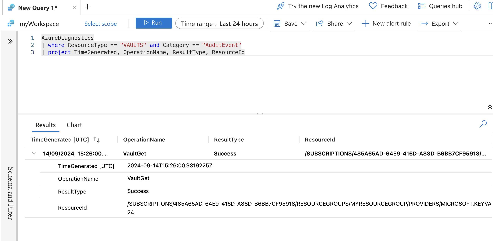

### Part 5: Auditing Key Vault Activity

#### 1. Introduction

##### **Overview of the Lab Objectives**
- Understand the importance of auditing Key Vault activity for security and compliance.
- Enable Azure Monitor for Key Vault to capture activity logs.
- Configure Diagnostic Logs for detailed insights into Key Vault operations.
- Analyze logs using Azure Monitor to identify and respond to potential security issues.

#### 2. Create a Log Analytics Workspace

##### **Create a Log Analytics Workspace**

```bash
az monitor log-analytics workspace create --resource-group myResourceGroup --workspace-name myWorkspace --location eastus
```

- This command creates a Log Analytics workspace named `myWorkspace` in the resource group `myResourceGroup` and location `eastus`.

#### 2. Enable Diagnostic Logging

##### **Enable Diagnostic Logging for Key Vault**

```bash
az monitor diagnostic-settings create --resource /subscriptions/<subscription-id>/resourceGroups/myResourceGroup/providers/Microsoft.KeyVault/vaults/<key-vault-name> --name "keyvault-diagnostics" --logs '[{"category": "AuditEvent","enabled": true}]' --workspace myWorkspace
```

- This command enables diagnostic logging for the Key Vault `myKeyVault` and sends the logs to the Log Analytics workspace `myWorkspace`.

#### 3. View Audit Logs in Azure Portal

##### **View Audit Logs**

- Open the [Azure Portal](https://portal.azure.com/).
- Navigate to "Log Analytics workspaces" in the left-hand menu.
- Select the workspace `myWorkspace`.
- In the workspace, navigate to "Logs" under the "General" section.
- Use the following query to view Key Vault audit logs:

```kusto
AzureDiagnostics
| where ResourceType == "VAULTS" and Category == "AuditEvent"
| project TimeGenerated, OperationName, ResultType, ResourceId
```



- This query filters the logs to show only Key Vault audit events and displays relevant information such as the time of the event, operation name, result type, and resource ID.