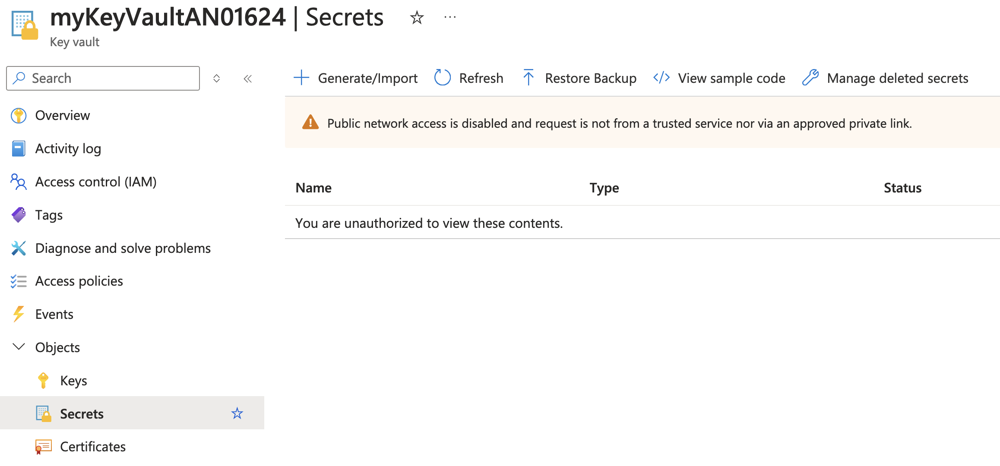
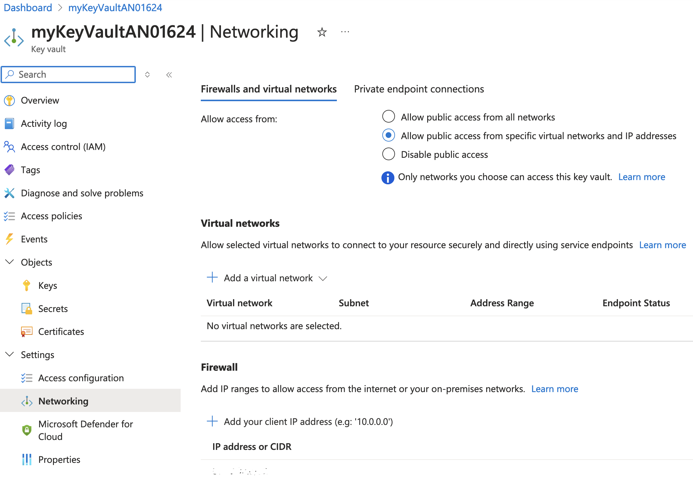
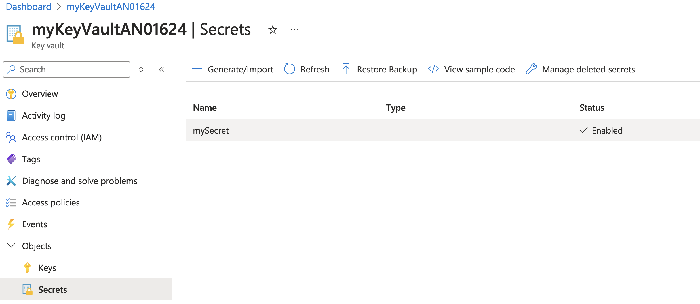

### Part 6: Network Isolation

Network isolation is essential for securing your Azure Key Vault by restricting access to specific virtual networks and IP addresses. This ensures that only authorized resources can access your Key Vault.

#### Disable Access from Public Networks

##### **Disable Public Network Access**

```bash
az keyvault update --name <key-vault-name> --resource-group myResourceGroup --public-network-access Disabled
```

- This command disables public network access to the Key Vault `myKeyVault`, ensuring that only private network access is allowed.

#### Verify Access Denied in Azure Portal

##### **Attempt to Access Key Vault**

- Open the [Azure Portal](https://portal.azure.com/).
- Navigate to "Key vaults" in the left-hand menu.
- Select the Key Vault.
- Attempt to access the secrets or certificates in the Key Vault.
- You should see an "Access denied" message, indicating that public network access is disabled.



#### Get User's Public IP Address

##### **Get Public IP Address**

```bash
curl https://api.ipify.org
```

- This command retrieves your public IP address. Note down the IP address returned by the command.

#### Add User's IP Address to Allowed List

##### **Enable Public Network Access With a default action of Deny**

```bash
az keyvault update \
  --resource-group myResourceGroup \
  --name <key-vault-name> \
  --public-network-access Enabled \
  --default-action Deny
```
- This command enables public network access for the Key Vault and sets the default action to `Deny`.

##### **Add IP Address Rule to Key Vault**

```bash
az keyvault network-rule add --resource-group myResourceGroup --name <key-vault-name> --ip-address <your-public-ip-address>
```
- Replace `<your-public-ip-address>` with the IP address obtained from the previous step. This command adds an IP address rule to the Key Vault, allowing access from your public IP address.

#### View Network Access in Azure Portal

##### **View Network Access Configuration**

- Open the [Azure Portal](https://portal.azure.com/).
- Navigate to "Key vaults" in the left-hand menu.
- Select the Key Vault `<key-vault-name>`.
- Go to the "Networking" section under "Settings".
- Verify that your IP address is listed under the "Firewall and virtual networks" section.


#### Verify Access Granted in Azure Portal

##### **Attempt to Access Key Vault Again**

- Open the [Azure Portal](https://portal.azure.com/).
- Navigate to "Key vaults" in the left-hand menu.
- Select the Key Vault `myKeyVault`.
- Attempt to access the secrets or certificates in the Key Vault again.
- You should now have access, indicating that your IP address has been successfully added to the allowed list.



This section guides users through disabling public network access, verifying access denial, obtaining their public IP address, adding their IP address to the allowed list, and verifying access to the Azure Key Vault.xxx