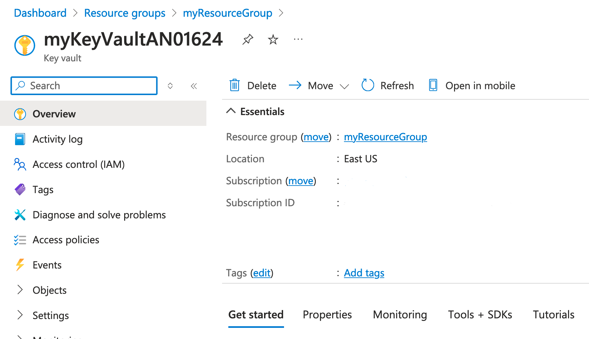
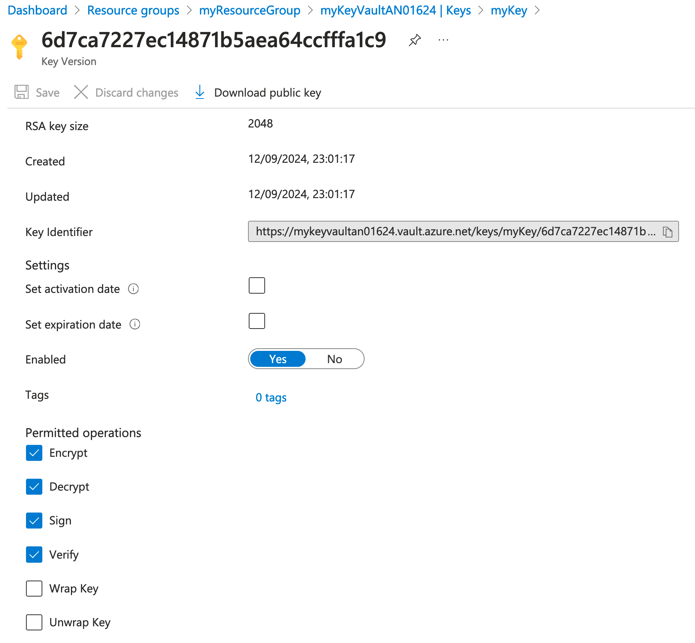

### Part 1: Introduction and Setup  

#### Introduction  

##### **Overview of the Lab Objectives**  
- Set up an Azure Key Vault using Azure CLI.
- Store and manage secrets, keys, and certificates in the Key Vault.
- Apply best practices for securing and accessing the Key Vault.
- Integrate the Key Vault with other Azure services.

##### **Brief on the Key Vault Architecture**  
- **Azure Key Vault**: Centralized cloud service for storing application secrets, keys, and certificates securely.
- **Azure CLI**: Command-line tool for managing Azure resources.

##### **Tools and Technologies Required**  
- **Azure CLI**: Command-line tool for managing Azure resources.
- **Azure Subscription**: Required to create and manage Azure resources.
- **Key Vault**: Azure service for managing secrets, keys, and certificates.

#### Environment Setup

##### **Install Azure CLI**  
**Azure CLI Installation**  
   - Follow the instructions from the official Azure website to install Azure CLI on your system:  
     - [Azure CLI for Windows](https://docs.microsoft.com/en-us/cli/azure/install-azure-cli-windows)  
     - [Azure CLI for Mac](https://docs.microsoft.com/en-us/cli/azure/install-azure-cli-macos)  
     - [Azure CLI for Linux](https://docs.microsoft.com/en-us/cli/azure/install-azure-cli-linux)  

##### **Verify Installation**  
- Open a terminal or command prompt and run:  
  ```bash  
  az --version
  ```

- You should see output indicating the installed version of Azure CLI.  

##### **Login to Azure and Select Subscription**

```bash
az login
```

- Use AZ CLI to log in to your Azure account. After logging in, you will see a list of available subscriptions and a prompt to select a subscription. Select the one specified by your instructor.

##### **Verify Current Tenant and Subscription**

```bash
az account show
```

- This command displays the details of the currently selected subscription and tenant. Verify that the correct subscription and tenant are selected.

#### Create a Key Vault 

##### **Create a Resource Group**  
- Create a resource group to hold your Key Vault:  
  ```bash  
  az group create --name myResourceGroup --location eastus  
  ```

##### **Resource Group Naming Instructions** 
- Resource Groups need to be unique within a subscription. If you receive an error message about a naming conflict. Simply try another name for your resource group and attempt to create it again.

##### **Create a Key Vault**  
Create a Key Vault in the resource group. Note: Key Vault names must be globally unique, which means 
no two Key Vaults in the world can have the same name. To ensure this, append your initials and a unique 
number to the Key Vault name. For example:

```bash  
az keyvault create --name myKeyVaultAN01624 --resource-group myResourceGroup --location eastus --enable-rbac-authorization
```

##### **Key Vault Naming Instructions** 
- Replace `myKeyVaultAN01624` with a unique name by adding your initials and a number.
- If the command fails due to the name being taken, modify the number or name slightly and try again.
- Key Vault names can contain alphanumeric characters (letters and numbers) and hyphens, but they must start and end with a letter or number and be between 3 and 24 characters long.

##### **View the Key Vault in the Azure Portal**  
- Open the [Azure Portal](https://portal.azure.com/).
- Navigate to "Resource groups" in the left-hand menu.
- Select the resource group `myResourceGroup`.
- Click on the Key Vault to view its details.



### Next Steps  
Proceed to Part 2 where you will create and retrieve keys.

### Part 2: Creating and Retrieving Keys

#### Introduction

##### **Overview of the Lab Objectives**
- Attempt to create a key in the Azure Key Vault.
- Understand the role-based access control (RBAC) requirements for managing keys.
- Assign the appropriate RBAC role to the currently logged-in user.
- Successfully create and retrieve keys from the Key Vault.

#### Assign Roles

##### Attempt to Create a Key in the Key Vault

  ```bash
  az keyvault key create --vault-name <key-vault-name> --name myKey --protection software --kty RSA --size 2048 --ops encrypt decrypt sign verify
  ```
  - Replace `<key-vault-name>` with the name of your key vault.
  - **Note:** This command will fail unless the user has the appropriate RBAC role assigned, such as the **Key Vault Crypto Officer** role.


##### Assign Key Vault Crypto Officer Role to the Currently Logged-In User

To assign the Key Vault Crypto Officer role to the currently logged-in user, follow these steps:

##### Get the Currently Logged-In User's Object ID, and the Current Subscription ID

```bash
az ad signed-in-user show --query id --output tsv
az account show --query id --output tsv
```

- These commands retrieve the object ID of the currently logged-in user and the current Subscription ID. Note down the IDs returned by the commands.


##### Assign The Key Vault Crypto Officer Role

```bash
az role assignment create --role "Key Vault Crypto Officer" --assignee <user-object-id> --scope /subscriptions/<subscription-id>/resourceGroups/myResourceGroup/providers/Microsoft.KeyVault/vaults/<key-vault-name>
```

- Replace `<user-object-id>` with the object ID obtained from the previous step.
- Replace `<subscription-id>` with your Azure subscription ID.
- Replace `<key-vault-name>` with the name of your key vault.
- This command assigns the Key Vault Crypto Officer role to the currently logged-in user for the Key Vault.


##### Verify Role Assignment

```bash
az role assignment list --assignee <user-object-id> --scope /subscriptions/<subscription-id>/resourceGroups/myResourceGroup/providers/Microsoft.KeyVault/vaults/<key-vault-name> --output table
```

- Replace `<user-object-id>` with the object ID obtained earlier.
- Replace `<subscription-id>` with your Azure subscription ID.
- Replace `<key-vault-name>` with the name of your key vault.
- This command lists the role assignments for the specified user and scope, allowing you to verify that the Key Vault Crypto Officer role has been assigned.

#### Create and Retrieve Keys

##### Create a Key

  ```bash
  az keyvault key create --vault-name <key-vault-name> \
  --name myKey \
  --protection software \
  --kty RSA \
  --size 2048 \
  --ops encrypt decrypt sign verify
  ```
  - Replace `<key-vault-name>` with the name of your key vault.
  - **Note:** This command should now work, now that your identity has been assigned the **Key Vault Crypto Officer** role.


##### Retrieve the Key

- Use AZ CLI to retrieve the key from the Key Vault:
  ```bash
  az keyvault key show --vault-name <key-vault-name> --name myKey
  ```

##### Confirm Key Creation in the Azure Portal
- Open the [Azure Portal](https://portal.azure.com/).
- Navigate to "Resource groups" in the left-hand menu.
- Select the resource group `myResourceGroup`.
- Click on the Key Vault.
- In the Key Vault, navigate to "Keys" under the "Objects" section.
- Confirm that the key `myKey` is listed.
- Click on the key `myKey` to view its details.
- Click on the current version.
- Under the "Key operations" section, confirm that the operations `encrypt`, `decrypt`, `sign`, and `verify` are listed.



### Part 3: Creating and Retrieving Secrets

#### Introduction

##### **Overview of the Lab Objectives**
- Understand the role-based access control (RBAC) requirements for managing keys.
- Assign the appropriate RBAC role to the currently logged-in user.
- Successfully create and retrieve secrets from the Key Vault.
- Create a new version of your secret.

### Assign Roles

#### Assign the Appropriate RBAC Role

- Refer to the Azure documentation to identify the role that grants permissions to create Key Vault secrets.
  
- Use the Azure CLI to assign this role to your user account. Ensure that you adhere to the **Principle of Least Privilege** by selecting the minimal permissions required for your tasks.

**Note:** Always review and verify the permissions associated with each role to ensure secure and appropriate access control.

##### Verify Role Assignments

```bash
az role assignment list --assignee <user-object-id> --scope /subscriptions/<subscription-id>/resourceGroups/myResourceGroup/providers/Microsoft.KeyVault/vaults/<key-vault-name> --output table
```

- This command lists the role assignments for the specified user and scope, allowing you to verify that both the Key Vault Crypto Officer and Key Vault Secrets Officer roles have now been assigned.

### Create and Retrieve Secrets

- Use the Azure CLI to create a new secret in your Key Vault. Ensure that you specify the correct Key Vault name and secret value.

- Retrieve the secret using the Azure CLI to confirm it has been stored correctly. Make sure to handle the output securely and avoid exposing sensitive information.

##### Confirm Secret Creation in the Azure Portal
- Open the [Azure Portal](https://portal.azure.com/).
- Navigate to "Resource groups" in the left-hand menu.
- Select the resource group `myResourceGroup`.
- Click on the Key Vault.
- In the Key Vault, navigate to "Secrets" under the "Settings" section.
- Confirm that the secret `mySecret` is listed.
- Click on the secret `mySecret` to view its details.
- Click on the current version.
- Click `Show Secret Value`


### Secret Version Management

#### Create a New Version of the Secret

- Determine how to create a new version of your secret using either the Azure portal or the Azure CLI.
- Verify the creation of the new version by viewing both the current and previous versions of the secret in your Key Vault.
- Use the Azure CLI to retrieve the older version of the secret to confirm its availability and integrity.

#### Additional Secret Management Tasks

- **Backup:** Download a backup of your secret to ensure you have a copy available in case of accidental deletion.
- **Delete:** Remove the secret from your Key Vault using the Azure Portal. Confirm that it has been removed from the list of secrets.
- **Restore Attempt:** Attempt to restore the secret from the backup file. If this fails, investigate whether the secret has been permanently deleted or if other issues are preventing the restoration.
- **Restore:** Successfully restore the deleted secret using the backup, and verify that it appears correctly in the Key Vault.

**Tip:** Always verify the secret’s status and versions before and after performing management tasks to ensure data integrity and security.

### Part 4: Creating and Retrieving Certificates

#### Introduction

##### **Overview of the Lab Objectives**
- Understand the role-based access control (RBAC) requirements for managing certificates.
- Assign the appropriate RBAC role to the currently logged-in user.
- Successfully create and retrieve certificates from the Key Vault.
- Create a new version of your certificate.

#### Assign the Appropriate RBAC Role

- Refer to the Azure documentation to identify the role that grants permissions to create Key Vault secrets.
  
- Use the Azure CLI to assign this role to your user account. Ensure that you adhere to the **Principle of Least Privilege** by selecting the minimal permissions required for your tasks.

**Note:** Always review and verify the permissions associated with each role to ensure secure and appropriate access control.

### **Verify Role Assignments**
- Check that the role has been correctly assigned to your user by listing their role assignments.

*Hint: Use commands to list role assignments and confirm the permissions.*


##### Create a policy.json file

```json
{
  "issuerParameters": {
    "name": "Self"
  },
  "keyProperties": {
    "exportable": true,
    "keySize": 2048,
    "keyType": "RSA",
    "reuseKey": true
  },
  "lifetimeActions": [
    {
      "action": {
        "actionType": "AutoRenew"
      },
      "trigger": {
        "daysBeforeExpiry": 30
      }
    }
  ],
  "secretProperties": {
    "contentType": "application/x-pem-file"
  },
  "x509CertificateProperties": {
    "extendedKeyUsage": ["1.3.6.1.5.5.7.3.1"],
    "keyUsage": [
      "cRLSign",
      "dataEncipherment",
      "digitalSignature",
      "keyEncipherment",
      "keyAgreement",
      "keyCertSign"
    ],
    "subject": "CN=example.com",
    "validityInMonths": 12
  }
}
```
- This policy file defines the properties of the certificate, including the key type, key size, subject, and validity period.

### **Retrieve the Certificate**
- Retrieve the certificate details from your Key Vault to verify its creation and configuration.

*Hint: Use Azure CLI commands to display certificate details.*

### **Verify the Certificate in the Azure Portal**
1. Go to the Azure Portal and navigate to your Key Vault.
2. Check the **Certificates** section to confirm that the certificate is listed and view its details.

#### Export the Certificate

##### **Export the Certificate**

- Use AZ CLI to export the certificate to your local machine in '.pem' format.

### **Convert the Certificate to PFX Format**
- Use OpenSSL or another tool to convert the PEM-formatted certificate to PFX format, commonly used for importing into various applications.

*Hint: Ensure you have the necessary tools installed for certificate conversion.*

### **Confirm the Exported Certificate**
- View the exported certificate file using a certificate management tool to ensure it matches the original properties set in the Key Vault.

### Part 5: Auditing Key Vault Activity

#### Introduction

##### **Overview of the Lab Objectives**
- Understand the importance of auditing Key Vault activity for security and compliance.
- Enable Azure Monitor for Key Vault to capture activity logs.
- Configure Diagnostic Logs for detailed insights into Key Vault operations.
- Analyze logs using Azure Monitor to identify and respond to potential security issues.

#### Create a Log Analytics Workspace

##### **Create a Log Analytics Workspace**

```bash
az monitor log-analytics workspace create --resource-group myResourceGroup --workspace-name myWorkspace --location eastus
```

- This command creates a Log Analytics workspace named `myWorkspace` in the resource group `myResourceGroup` and location `eastus`.

#### Enable Diagnostic Logging

##### **Enable Diagnostic Logging for Key Vault**

```bash
az monitor diagnostic-settings create \
  --resource /subscriptions/<subscription-id>/resourceGroups/myResourceGroup/providers/Microsoft.KeyVault/vaults/<key-vault-name> \
  --name "keyvault-diagnostics" \
  --logs '[{"category": "AuditEvent","enabled": true}]' \
  --workspace myWorkspace
```

- This command enables diagnostic logging for the Key Vault and sends the logs to the Log Analytics workspace `myWorkspace`.

### View Audit Logs in Azure Portal

#### View Audit Logs

- **Kusto Query:** Construct a Kusto query in your Log Analytics workspace that filters all Key Vault audit activity. Make sure to scope it specifically to the Key Vault you created to isolate relevant events.
  
- **Backup and Restore:** Perform a backup and restore operation on a Key Vault item. Rerun your query to check for any new events related to these activities.

- **Enable Log Categories:** Update the diagnostic settings for your Key Vault to include the 'Request' and 'Errors' log categories. Perform actions like creating or deleting keys to generate new log entries.

- **Refine Your Query:** Rerun your query, this time focusing on the new log categories. Observe and analyze the changes in log data to better understand how different activities are logged in Key Vault.

**Note:** Regularly review and update your diagnostic settings and queries to ensure comprehensive monitoring and auditing of Key Vault activities.

# Part 6: Network Isolation for Azure Key Vault

## **Introduction**
Network isolation is crucial for securing Azure Key Vault by restricting access to specific virtual networks and IP addresses. This ensures that only authorized resources can access your Key Vault, reducing the risk of unauthorized data access.

## **Steps to Implement Network Isolation**

### **1. Disable Access from Public Networks**

Disabling public network access helps prevent any unauthorized access attempts from outside your designated network.

**Disable Public Network Access:**
- Go to your Key Vault in the Azure Portal.
- Navigate to the **Networking** section.
- Remove public access.

*Note: After making this change, all public access to your Key Vault will be blocked.*

**Test Access Restrictions:**
- Attempt to access Key Vault resources, such as secrets or certificates, from a public network.
- Verify that access is denied.

### **2. Enable Public Network Access with Restrictions**

If you need limited public access, you can configure the Key Vault to allow only specific IP addresses.

**Get Your Public IP Address:**
- Retrieve your public IP address.
- Record the IP address for use in the next step.

**Enable Public Network Access with Restrictions:**
- Enable public network access on your Key Vault.
- Set the network configuration to allow only your recorded IP address.
- Save the changes.

**Verify Configuration:**
- Access the Key Vault from your allowed IP address.
- Check in the Azure Portal under the **Networking** section to see your IP listed with a status of **Allow**.

### **3. Deleting the Key Vault**

Deleting a Key Vault can sometimes generate errors. Follow these steps to troubleshoot:

**Attempt to Delete the Key Vault:**
- Try deleting the Key Vault through the Azure Portal or Azure CLI.

**Troubleshoot Deletion Errors:**
- If you encounter errors, review the errors generated and determine the reason for failure.
- Make necessary adjustments.
- Delete the Key Vault.

# Part 7: Creating Key Vault with Terraform

## **Introduction**
In this part, you'll learn how to automate the creation and management of Azure Key Vault using Terraform. By leveraging Infrastructure as Code (IaC), you can ensure consistent, repeatable deployments across your environments.

## **Terraform Installation**

```bash
choco install terraform
```

**Note:** If you don't have Chocolatey installed, you can follow the instructions at chocolatey.org/install.

## **Setup and Configuration**

### **1. Configure Backend Storage**
Create an Azure Storage Account to store the Terraform state file. This ensures that your state is maintained centrally and can be shared among multiple collaborators.

### **2. Create the Key Vault Resource**
Use the `azurerm_key_vault` resource in Terraform to define your Key Vault. This resource should include specifications like name, resource group and location.

*Hint: Define RBAC roles and assignments to manage permissions for different users and services.*

### **3. Enable Purge Protection**
Once the Key Vault is created, enable Purge Protection using your existing Terraform configuration. This feature prevents permanent deletion of the Key Vault or its contents, adding an extra layer of security.

### **4. Optional: Create Certificates, Secrets, and Keys**
Optionally, use Terraform to create and manage certificates, secrets, and keys in your Key Vault. This enables centralized management of sensitive information in your infrastructure.


### Lab Completion

Congratulations! You have successfully completed the lab. You have learned how to:

- Set up and configure Azure Key Vault to securely store and manage sensitive information.
- Implement and manage role-based access control (RBAC) to control permissions for Key Vault resources.
- Use Terraform to automate the creation and configuration of Key Vaults, including enabling features like purge protection.
- Create and manage secrets, certificates, and keys within Key Vault.
- Secure access to Key Vault by enabling network isolation and restricting access to specific virtual networks and IP addresses.

Explore further labs or exercises to continue expanding your knowledge of Azure Key Vault and related security features.

