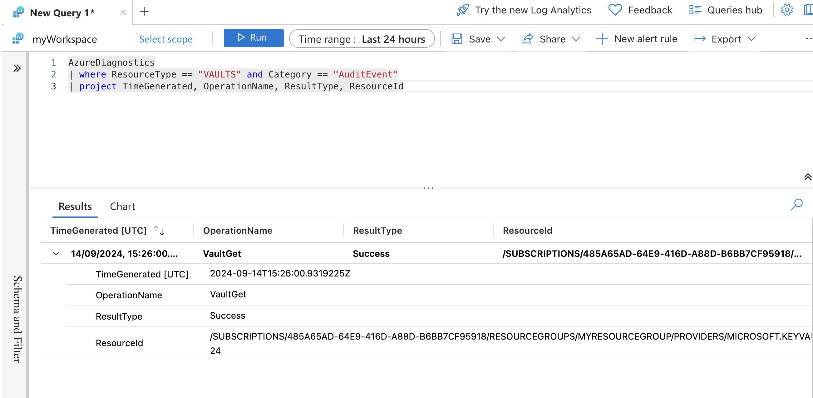

### Part 1: Introduction and Setup  

#### Introduction  

##### **Overview of the Lab Objectives**  
- Set up an Azure Key Vault using Azure CLI.
- Store and manage secrets, keys, and certificates in the Key Vault.
- Apply best practices for securing and accessing the Key Vault.
- Integrate the Key Vault with other Azure services.

##### **Brief on the Key Vault Architecture**  
- **Azure Key Vault**: Centralized cloud service for storing application secrets, keys, and certificates securely.
- **Azure CLI**: Command-line tool for managing Azure resources.

##### **Tools and Technologies Required**  
- **Azure CLI**: Command-line tool for managing Azure resources.
- **Azure Subscription**: Required to create and manage Azure resources.
- **Key Vault**: Azure service for managing secrets, keys, and certificates.

#### Environment Setup

##### **Install Azure CLI**  
**Azure CLI Installation**  
   - Follow the instructions from the official Azure website to install Azure CLI on your system:  
     - [Azure CLI for Windows](https://docs.microsoft.com/en-us/cli/azure/install-azure-cli-windows)  
     - [Azure CLI for Mac](https://docs.microsoft.com/en-us/cli/azure/install-azure-cli-macos)  
     - [Azure CLI for Linux](https://docs.microsoft.com/en-us/cli/azure/install-azure-cli-linux)  

##### **Verify Installation**  
- Open a terminal or command prompt and run:  
  ```bash  
  az --version
  ```

- You should see output indicating the installed version of Azure CLI.  

##### **Login to Azure and Select Subscription**

```bash
az login
```

- Use the Azure CLI to log in to your Azure account. After logging in, you will see a list of available subscriptions and a prompt to select a subscription. Select the one specified by your instructor.

##### **Verify Current Tenant and Subscription**

```bash
az account show
```

- This command displays the details of the currently selected subscription and tenant. Verify that the correct subscription and tenant are selected.

#### Create a Key Vault 

##### **Create a Resource Group**  
# NEED TO GENERATE UNIQUE NAME FOR EACH RESOURCE GROUP IF EVERY STUDENT USING SAME TENANT
- Create a resource group to hold your Key Vault:  
  ```bash  
  az group create --name myResourceGroup --location eastus  
  ```

##### **Create a Key Vault**  
Create a Key Vault in the resource group. Note: Key Vault names must be globally unique, which means 
no two Key Vaults in the world can have the same name. To ensure this, append your initials and a unique 
number to the Key Vault name. For example:

```bash  
az keyvault create --name myKeyVaultAN01624 --resource-group myResourceGroup --location eastus --enable-rbac-authorization
```

##### **Key Vault Naming Instructions** 
- Replace `myKeyVaultAN01624` with a unique name by adding your initials and a number.
- If the command fails due to the name being taken, modify the number or name slightly and try again.
- Key Vault names can contain alphanumeric characters (letters and numbers) and hyphens, but they must start and end with a letter or number and be between 3 and 24 characters long.

##### **View the Key Vault in the Azure Portal**  
- Open the [Azure Portal](https://portal.azure.com/).
- Navigate to "Resource groups" in the left-hand menu.
- Select the resource group `myResourceGroup`.
- Click on the Key Vault to view its details.


### Part 2: Creating and Retrieving Keys

#### Introduction

##### **Overview of the Lab Objectives**
- Attempt to create a key in the Azure Key Vault.
- Understand the role-based access control (RBAC) requirements for managing keys.
- Assign the appropriate RBAC role to the currently logged-in user.
- Successfully create and retrieve keys from the Key Vault.

#### Assign Roles

##### Attempt to Create a Key in the Key Vault

  ```bash
  az keyvault key create --vault-name <key-vault-name> --name myKey --protection software --kty RSA --size 2048 --ops encrypt decrypt sign verify
  ```
  - Replace `<key-vault-name>` with the name of your key vault.
  - **Note:** This command will fail unless the user has the appropriate RBAC role assigned, such as the **Key Vault Crypto Officer** role.


##### Assign Key Vault Crypto Officer Role to the Currently Logged-In User

To assign the Key Vault Crypto Officer role to the currently logged-in user, follow these steps:

##### Get the Currently Logged-In User's Object ID, and the Current Subscription ID

```bash
az ad signed-in-user show --query id --output tsv
az account show --query id --output tsv
```

- These commands retrieve the object ID of the currently logged-in user and the current Subscription ID. Note down the IDs returned by the commands.


##### Assign The Key Vault Crypto Officer Role

```bash
az role assignment create --role "Key Vault Crypto Officer" --assignee <user-object-id> --scope /subscriptions/<subscription-id>/resourceGroups/myResourceGroup/providers/Microsoft.KeyVault/vaults/<key-vault-name>
```

- Replace `<user-object-id>` with the object ID obtained from the previous step.
- Replace `<subscription-id>` with your Azure subscription ID.
- Replace `<key-vault-name>` with the name of your key vault.
- This command assigns the Key Vault Crypto Officer role to the currently logged-in user for the Key Vault.


##### Verify Role Assignment

```bash
az role assignment list --assignee <user-object-id> --scope /subscriptions/<subscription-id>/resourceGroups/myResourceGroup/providers/Microsoft.KeyVault/vaults/<key-vault-name> --output table
```

- Replace `<user-object-id>` with the object ID obtained earlier.
- Replace `<subscription-id>` with your Azure subscription ID.
- Replace `<key-vault-name>` with the name of your key vault.
- This command lists the role assignments for the specified user and scope, allowing you to verify that the Key Vault Crypto Officer role has been assigned.

#### Create and Retrieve Keys

##### Create a Key

  ```bash
  az keyvault key create --vault-name <key-vault-name> \
  --name myKey \
  --protection software \
  --kty RSA \
  --size 2048 \
  --ops encrypt decrypt sign verify
  ```
  - Replace `<key-vault-name>` with the name of your key vault.
  - **Note:** This command should now work, now that your identity has been assigned the **Key Vault Crypto Officer** role.


##### Retrieve the Key

- Use the Azure CLI to retrieve the key from the Key Vault:
  ```bash
  az keyvault key show --vault-name <key-vault-name> --name myKey
  ```

##### Confirm Key Creation in the Azure Portal
- Open the [Azure Portal](https://portal.azure.com/).
- Navigate to "Resource groups" in the left-hand menu.
- Select the resource group `myResourceGroup`.
- Click on the Key Vault.
- In the Key Vault, navigate to "Keys" under the "Objects" section.
- Confirm that the key `myKey` is listed.
- Click on the key `myKey` to view its details.
- Click on the current version.
- Under the "Key operations" section, confirm that the operations `encrypt`, `decrypt`, `sign`, and `verify` are listed.


### Part 3: Creating and Retrieving Secrets

#### Introduction

##### **Overview of the Lab Objectives**
- Understand the role-based access control (RBAC) requirements for managing keys.
- Assign the appropriate RBAC role to the currently logged-in user.
- Successfully create and retrieve secrets from the Key Vault.
- Create a new version of your secret.

#### Assign Roles

##### Assign The Key Vault Secrets Officer Role

```bash
az role assignment create --role "Key Vault Secrets Officer" --assignee <user-object-id> --scope /subscriptions/<subscription-id>/resourceGroups/myResourceGroup/providers/Microsoft.KeyVault/vaults/<key-vault-name>
```

- This command assigns the Key Vault Secrets Officer role to the currently logged-in user for the Key Vault.

##### Verify Role Assignments

```bash
az role assignment list --assignee <user-object-id> --scope /subscriptions/<subscription-id>/resourceGroups/myResourceGroup/providers/Microsoft.KeyVault/vaults/<key-vault-name> --output table
```

- This command lists the role assignments for the specified user and scope, allowing you to verify that both the Key Vault Crypto Officer and Key Vault Secrets Officer roles have now been assigned.

#### Create and Retrieve Secrets

##### Create a Secret

  ```bash
az keyvault secret set \
  --vault-name <key-vault-name> \
  --name mySecret \
  --value "mySecretValue" \
  --description "This is a test secret with additional options" \
  --tags env=test \
  --content-type "text/plain"
  ```

- This command creates a secret with the value mySecretValue, a description, tags it with env=test, and sets the content type to text/plain.

##### Retrieve the Secret

  ```bash
  az keyvault secret show --vault-name <key-vault-name> --name mySecret --query value
  ```
- Replace `<key-vault-name>` with the name of your key vault.

##### Confirm Secret Creation in the Azure Portal
- Open the [Azure Portal](https://portal.azure.com/).
- Navigate to "Resource groups" in the left-hand menu.
- Select the resource group `myResourceGroup`.
- Click on the Key Vault.
- In the Key Vault, navigate to "Secrets" under the "Settings" section.
- Confirm that the secret `mySecret` is listed.
- Click on the secret `mySecret` to view its details.
- Click on the current version.
- Click `Show Secret Value`


##### Create a New Version of the Secret

  ```bash
  az keyvault secret set --vault-name <key-vault-name> --name mySecret --value "myNewSecretValue"
  ```
- This command creates a new version of the secret mySecret with the value myNewSecretValue.

##### Confirm New Version in the Azure Portal
- Open the [Azure Portal](https://portal.azure.com/).
- Navigate to "Resource groups" in the left-hand menu.
- Select the resource group `myResourceGroup`.
- Click on the Key Vault `myKeyVault`.
- In the Key Vault, navigate to "Secrets" under the "Settings" section.
- Confirm that the secret `mySecret` is listed.
- Click on the secret `mySecret` to view its details.
- Click on the Current version
- Confirm that the new version with the value `myNewSecretValue` is listed.
- **Note:** Key vault maintains versioned secrets. Click on the older version to view the old secret value
- **Note:** Take a look at the content type and tags on both versions of the secrets.
- **Note:** The new version can take a minute or two to display in the portal. Keep refreshing the page until the new version appears.


### Part 4: Creating and Retrieving Certificates

#### Introduction

##### **Overview of the Lab Objectives**
- Understand the role-based access control (RBAC) requirements for managing certificates.
- Assign the appropriate RBAC role to the currently logged-in user.
- Successfully create and retrieve certificates from the Key Vault.
- Create a new version of your certificate.

#### Assign Roles

##### Assign The Key Vault Certificates Officer Role

```bash
az role assignment create --role "Key Vault Certificates Officer" --assignee <user-object-id> --scope /subscriptions/<subscription-id>/resourceGroups/myResourceGroup/providers/Microsoft.KeyVault/vaults/<key-vault-name>
```

- This command assigns the Key Vault Secrets Officer role to the currently logged-in user for the Key Vault.

##### Verify Role Assignments

```bash
az role assignment list --assignee <user-object-id> --scope /subscriptions/<subscription-id>/resourceGroups/myResourceGroup/providers/Microsoft.KeyVault/vaults/<key-vault-name> --output table
```

- This command lists the role assignments for the specified user and scope, allowing you to verify that the Key Vault Crypto Officer, the Key Vault Secrets Officer and the Key Vault Certificates Officer roles have now been assigned.

#### Create and Retrieve Secrets

##### Create a policy.json file

```json
{
  "issuerParameters": {
    "name": "Self"
  },
  "keyProperties": {
    "exportable": true,
    "keySize": 2048,
    "keyType": "RSA",
    "reuseKey": true
  },
  "lifetimeActions": [
    {
      "action": {
        "actionType": "AutoRenew"
      },
      "trigger": {
        "daysBeforeExpiry": 30
      }
    }
  ],
  "secretProperties": {
    "contentType": "application/x-pem-file"
  },
  "x509CertificateProperties": {
    "extendedKeyUsage": ["1.3.6.1.5.5.7.3.1"],
    "keyUsage": [
      "cRLSign",
      "dataEncipherment",
      "digitalSignature",
      "keyEncipherment",
      "keyAgreement",
      "keyCertSign"
    ],
    "subject": "CN=example.com",
    "validityInMonths": 12
  }
}
```
- This policy file defines the properties of the certificate, including the key type, key size, subject, and validity period.

##### **Create a Certificate**

```bash
az keyvault certificate create --vault-name <key-vault-name> --name myCertificate --policy @policy.json
```

- This command creates a certificate named `myCertificate` in the Key Vault using the policy defined in the `policy.json` file.

##### **Retrieve the Certificate**

```bash
az keyvault certificate show --vault-name <key-vault-name> --name myCertificate
```

- This command retrieves the details of the certificate named `myCertificate` from the Key Vault `<key-vault-name>`.

#### Confirm Certificate Creation in the Azure Portal

##### **View the Certificate in the Azure Portal**
- Open the [Azure Portal](https://portal.azure.com/).
- Navigate to "Resource groups" in the left-hand menu.
- Select the resource group `myResourceGroup`.
- Click on the Key Vault.
- In the Key Vault, navigate to "Certificates" under the "Settings" section.
- Confirm that the certificate `myCertificate` is listed.
- Click on the certificate `myCertificate` to view its details.
- Click on the current version.
- Under the "Properties" section, confirm that the certificate properties are correctly set.


#### Export the Certificate

##### **Export the Certificate**

```bash
az keyvault secret download --vault-name <key-vault-name> --name myCertificate --file myCertificate.pem
```

- This command exports the certificate named `myCertificate` from the Key Vault to a file named `myCertificate.pem`.

##### **Convert the Certificate to PFX Format**

```bash
openssl pkcs12 -export -out myCertificate.pfx -in myCertificate.pem
```

- This command converts the PEM-formatted certificate to PFX format, which is commonly used for importing certificates into various applications.

- This command converts the PEM-formatted certificate to PFX format, which is commonly used for importing certificates into various applications.

#### Confirm Exported Certificate

##### **View the Exported Certificate**
- Open the exported certificate file `myCertificate.pem` or `myCertificate.pfx` using a certificate management tool.
- Confirm that the certificate details match the original certificate created in the Key Vault.

### Part 5: Auditing Key Vault Activity

#### Introduction

##### **Overview of the Lab Objectives**
- Understand the importance of auditing Key Vault activity for security and compliance.
- Enable Azure Monitor for Key Vault to capture activity logs.
- Configure Diagnostic Logs for detailed insights into Key Vault operations.
- Analyze logs using Azure Monitor to identify and respond to potential security issues.

#### Create a Log Analytics Workspace

##### **Create a Log Analytics Workspace**

```bash
az monitor log-analytics workspace create --resource-group myResourceGroup --workspace-name myWorkspace --location eastus
```

- This command creates a Log Analytics workspace named `myWorkspace` in the resource group `myResourceGroup` and location `eastus`.

#### Enable Diagnostic Logging

##### **Enable Diagnostic Logging for Key Vault**

```bash
az monitor diagnostic-settings create \
  --resource /subscriptions/<subscription-id>/resourceGroups/myResourceGroup/providers/Microsoft.KeyVault/vaults/<key-vault-name> \
  --name "keyvault-diagnostics" \
  --logs '[{"category": "AuditEvent","enabled": true}]' \
  --workspace myWorkspace
```

- This command enables diagnostic logging for the Key Vault and sends the logs to the Log Analytics workspace `myWorkspace`.

#### View Audit Logs in Azure Portal

##### **View Audit Logs**

- Open the [Azure Portal](https://portal.azure.com/).
- Navigate to "Log Analytics workspaces" in the left-hand menu.
- Select the workspace `myWorkspace`.
- In the workspace, navigate to "Logs" under the "General" section.
- Use the following query to view Key Vault audit logs:

```kusto
AzureDiagnostics
| where ResourceType == "VAULTS" and Category == "AuditEvent"
| project TimeGenerated, OperationName, ResultType, ResourceIdffffghjnbvcdt
```



- This query filters the logs to show only Key Vault audit events and displays relevant information such as the time of the event, operation name, result type, and resource ID.

### Part 6: Network Isolation

Network isolation is essential for securing your Azure Key Vault by restricting access to specific virtual networks and IP addresses. This ensures that only authorized resources can access your Key Vault.

#### Disable Access from Public Networks

##### **Disable Public Network Access**

```bash
az keyvault update --name <key-vault-name> --resource-group myResourceGroup --public-network-access Disabled
```

- This command disables public network access to the Key Vault `myKeyVault`, ensuring that only private network access is allowed.

#### Verify Access Denied in Azure Portal

##### **Attempt to Access Key Vault**

- Open the [Azure Portal](https://portal.azure.com/).
- Navigate to "Key vaults" in the left-hand menu.
- Select the Key Vault.
- Attempt to access the secrets or certificates in the Key Vault.
- You should see an "Access denied" message, indicating that public network access is disabled.


#### Get User's Public IP Address

##### **Get Public IP Address**

```bash
curl https://api.ipify.org
```

- This command retrieves your public IP address. Note down the IP address returned by the command.

#### Add User's IP Address to Allowed List

##### **Enable Public Network Access With a default action of Deny**

```bash
az keyvault update \
  --resource-group myResourceGroup \
  --name <key-vault-name> \
  --public-network-access Enabled \
  --default-action Deny
```
- This command enables public network access for the Key Vault and sets the default action to `Deny`.

##### **Add IP Address Rule to Key Vault**

```bash
az keyvault network-rule add --resource-group myResourceGroup --name <key-vault-name> --ip-address <your-public-ip-address>
```
- Replace `<your-public-ip-address>` with the IP address obtained from the previous step. This command adds an IP address rule to the Key Vault, allowing access from your public IP address.

#### View Network Access in Azure Portal

##### **View Network Access Configuration**

- Open the [Azure Portal](https://portal.azure.com/).
- Navigate to "Key vaults" in the left-hand menu.
- Select the Key Vault `<key-vault-name>`.
- Go to the "Networking" section under "Settings".
- Verify that your IP address is listed under the "Firewall and virtual networks" section.


#### Verify Access Granted in Azure Portal

##### **Attempt to Access Key Vault Again**

- Open the [Azure Portal](https://portal.azure.com/).
- Navigate to "Key vaults" in the left-hand menu.
- Select the Key Vault `myKeyVault`.
- Attempt to access the secrets or certificates in the Key Vault again.
- You should now have access, indicating that your IP address has been successfully added to the allowed list.


This section guides users through disabling public network access, verifying access denial, obtaining their public IP address, adding their IP address to the allowed list, and verifying access to the Azure Key Vault.xxx